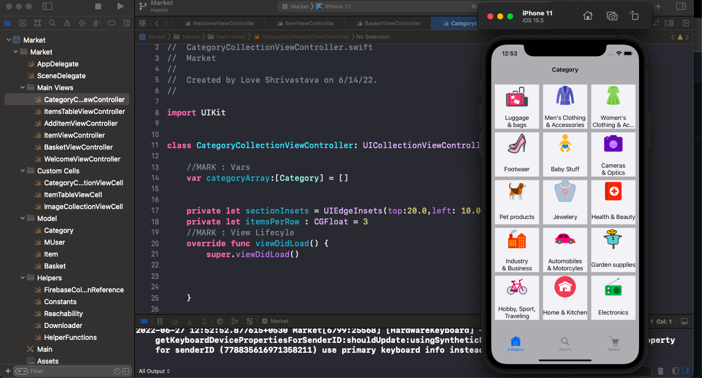
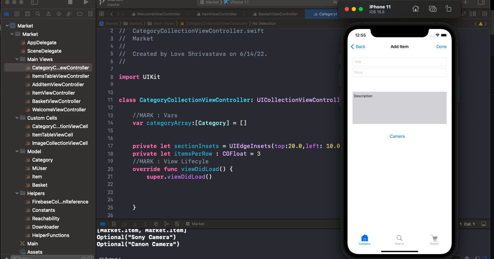
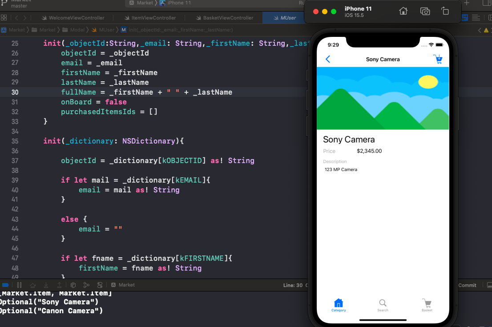
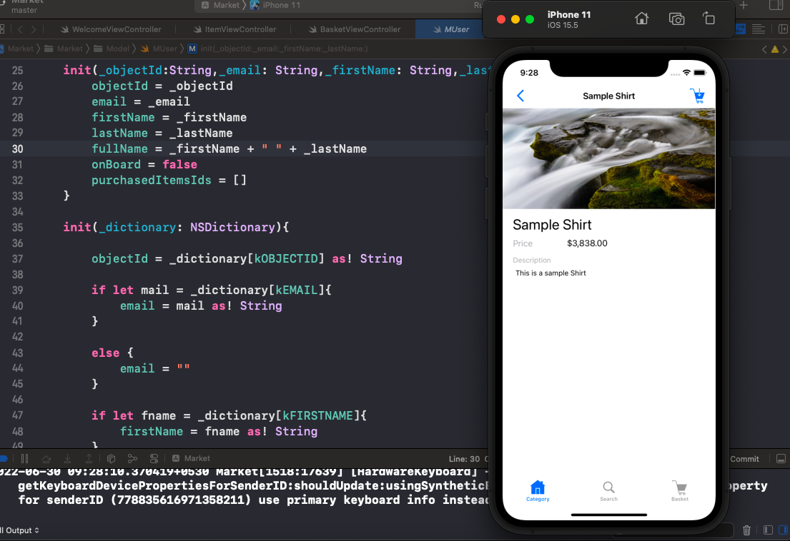
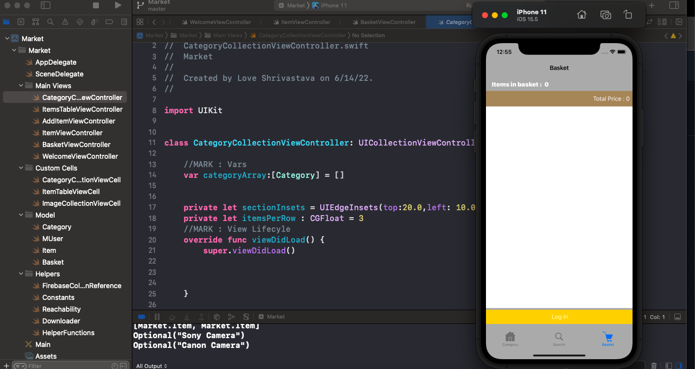
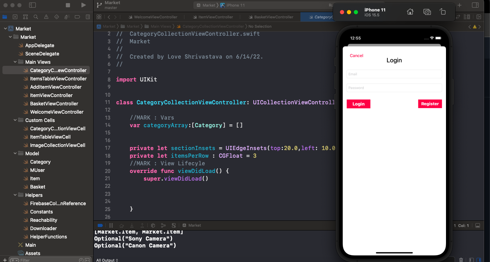
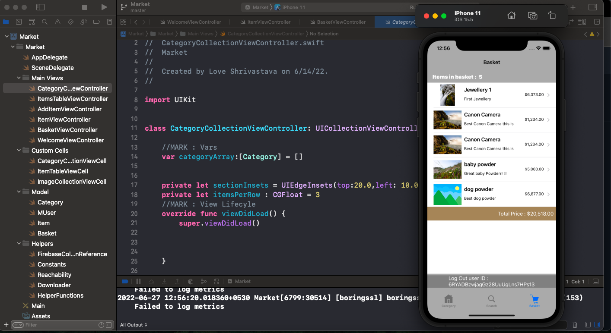
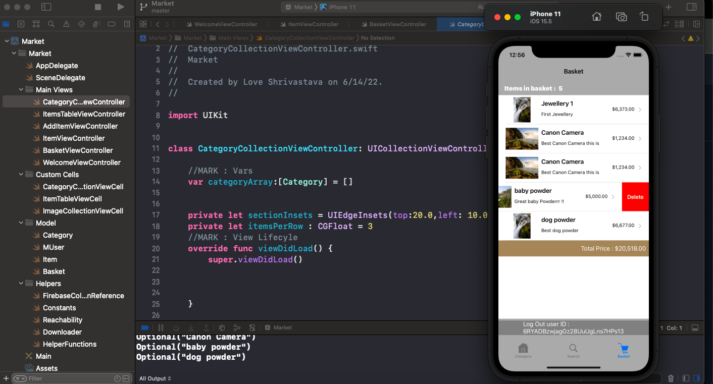

# E - Commerce - iOS App

 
 ### CATEGORY VIEW - Welcome Screen of App
   

 
 ### ADD ITEM VIEW - Add item details, which gets uploaded in the database, and shown for the category.
 
  

 
 ### ITEM DETAILS PAGE - Show the item details, its pictures, description, title and price.
 
   

 
 ### ITEM DEATILS PAGE - Show the item details, its pictures, description, title and price.
 
   

 
 ### CART VIEW LOGIN PAGE - Show the cart of the currently logged in user, or ask the user to login, if logged out.
 
   

 
 ### LOGIN PAGE - Lets users create an account, verified through a link sent in email through firebase authentication and log in to sync their cart items. 
 
   

 
 ### CART VIEW PAGE - Show the cart of the currently logged in user, and his user ID, assigned through firebase.
 
   

 
 ### CART VIEW - Show the cart of the currently logged in user, also, enabling him/her to add and delete items from the cart.

# Description :

<ul>
<li>Developed an E - Commerce iOS Application that lets users, authenticated through Firebase, add items for different categories like home decor, pets, Automobile, Camera, Electronics etc.(as sellers) </li>
<li>For every item, specific users can add the item name, price, description and upload images. Users (as customers) can create their own cart for their email ID, add the items and sync their cart items through Firebase.</li> 
<li> Cart displays the the items added, total price and number of items, enables users place orders, reflected in the backend firebase database.</li>
<li> Swift programming language along with Storyboards (for developing UI of app) was used to develop the app </li>
</ul> 
 
 
 
 
